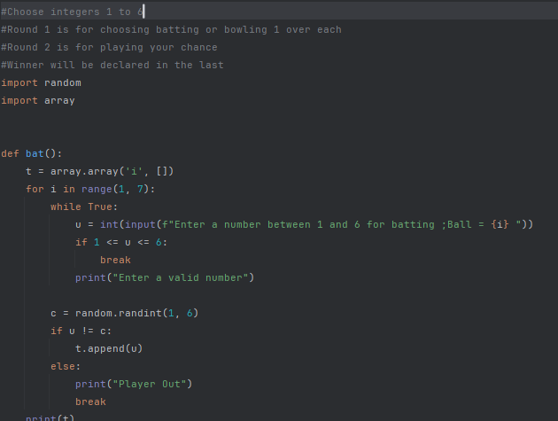
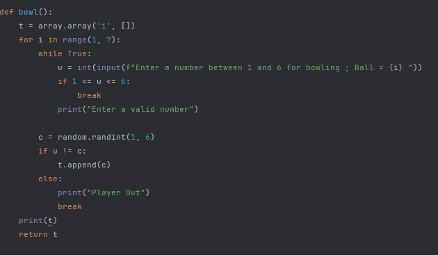
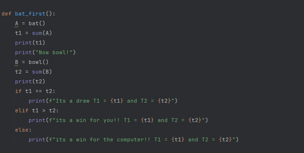
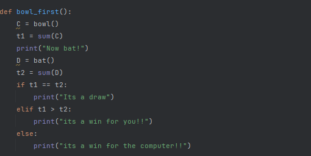
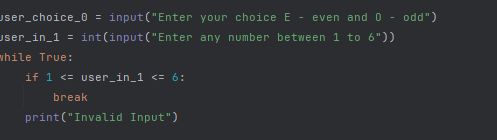
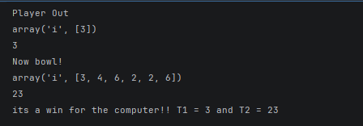

**Numeral Cricket**
- Overview of the project:
  - This program is based on the Game Cricket but all with numbers instead of physical equipments.
  - It utilised multiple inbuilt functions as well as imported functions to Give an immersive experience to the player
     and a better understanding of different operations that wer involved in the creation of this project
- Features:
  1. Toss module using odd even principle
  2. User Defined functions like Bat and Bowl
  3. Switching of places with the computer
  4. Scorecard 
  5. Final result
- Technologies/ Tools used:
  1. Pycharm IDE/ Jupyter Notebook
  2. Random Module
  3. Array Module
- Steps to run the Project:
  1. Copy the code
  2. Use any Python based IDE
  3. Paste the code
  4. Run the program
  5. Follow the instructions
  6. Wim , play amd learn
-  Instructions for testing:
   - Enter a value out of range in Batting/Bowling/Toss
   - Enter any lowercase value of the specified string
- Screenshots
  1. 
  2. 
  3. 
  4. 
  5. 
  6. 

